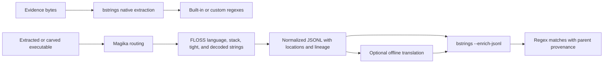

# bstrings

`bstrings` extracts readable code-page and UTF-16LE strings from files and
directories, keeps their byte offsets, and can immediately narrow the output
with literal searches, custom regular expressions, or 51 built-in forensic
patterns.

This fork keeps Eric Zimmerman's familiar command-line workflow and extends it
for large evidence sets: bounded parallel processing, streaming output,
validated CPU/CUDA/hybrid extraction, an opt-in Rust scanner, safer and faster
regex handling, and provenance-preserving FLOSS and offline-translation
enrichment.

## Start here

Choose the row that best matches what you are trying to do.

| Goal | Recommended starting point |
| --- | --- |
| Extract every readable string | `bstrings.exe -f <image> --processor auto --off -s -o strings.txt` |
| Find common forensic indicators | `bstrings.exe -f <image> --lr all --ro --off -s -o hits.csv` |
| Triage wallet and on-ledger identifiers | `bstrings.exe -f <image> --lr wallets --ro --off -s -o wallets.csv` |
| Search for a known word or phrase | Add `--ls "search text"` |
| Search with your own regex | Add `--lr "<expression>"`, or use `--fr <file>` for several expressions |
| Recursively inspect extracted files | Use `-d <directory>` with `--mask` and optionally `--ms` |
| Recover decoded or stack-built strings from executables | Run the Magika/FLOSS enrichment adapter, then feed its JSONL back to `bstrings` |
| Search text written in other languages | Add the offline Hy-MT2 translation pass before the enrichment regex step |
| Force a hardware path for testing | Use `--processor cpu`, `gpu`, or `hybrid`; normal examinations should start with `auto` |

If you only need one safe default, use `--processor auto`, write to a file with
`-o`, keep offsets with `--off`, and check that the sibling `.incomplete`
marker disappears before treating the output as complete.

## Why choose this fork?

| Decision point | Donovoi/bstrings | Original bstrings | ripgrep | bulk_extractor |
| --- | --- | --- | --- | --- |
| 100 GiB sparse URL/email scan | **42.19 s / 2,427 MiB/s** | 187.66 s / 545.7 MiB/s | 180.77 s / 566.5 MiB/s | 319.34 s / 320.7 MiB/s |
| Current built-in catalog | **51 patterns; 27-pattern `wallets` group with offline semantic validation** | Smaller legacy catalog | User-supplied regexes | Purpose-built scanners and feature files |
| Reviewed 33-pattern exactness benchmark at 256 MiB | **33/33** | 15/33 | 25/33 stream-comparable | 0/33 through find/RE2 |
| Reviewed shape-correct invalid corpus, 1 MiB/pattern | **73,480/73,480 rejected; 33/33 exact** | Regex-only baseline retained all 73,480 | Not measured | Scanner semantics differ |
| Speed on exact per-pattern overlaps | **15/15 wins vs original, 2.02–2.39×** | Slower on every exact overlap | Fork wins 10/25; ripgrep wins 15/25 | Not ranked: no pattern passed the complete boundary corpus |
| Readable-string extraction | Code-page and UTF-16LE, offsets, streaming filters | Code-page and UTF-16LE | Raw byte/text search, not a strings extractor | Structured feature scanners and carving, not generic strings output |
| Enrichment | Magika-routed FLOSS recovery plus attributable offline translation | None | None | Recursive decoding and feature scanners, but no lineage into this regex catalog |
| Chunk boundaries | Rejects clipped edge fragments and recovers complete crossing strings | Can emit clipped or duplicate boundary matches | Searcher-managed | Scanner-specific page margins |
| Hardware paths | SIMD CPU, opt-in Rust ASCII, validated CUDA, and CPU+GPU hybrid | CPU | CPU | Multi-threaded CPU scanners |
| Best fit | Large evidence images when strings, forensic patterns, offsets, and auditable completion all matter | Original CLI compatibility | Fast known-pattern triage over raw bytes | Broad feature extraction, recursive decoding, carving, and histograms |

These are synthetic, warm-cache measurements—not universal rankings. Every
timed comparison first had to return the exact expected records and offsets,
including chunk-crossing and terminal cases. See the
[scale benchmark](docs/scale-benchmark-2026-08.md),
[pattern and engine benchmark](docs/pattern-engine-benchmark-2026-08.md),
[pattern validity review](docs/pattern-validity-review-2026-08.md), and
[translation benchmark](docs/translation-benchmark-2026-08-04.md) before
generalizing the numbers.

## Install or build

The supported packaged target is self-contained Windows x64. GitHub Actions
builds and packages it on every pull request and push to `master`; tagged
versions beginning with `v` create releases.

To build it yourself, install the .NET 9 SDK:

```powershell
git clone https://github.com/Donovoi/bstrings.git
cd bstrings

dotnet restore bstrings.sln
dotnet build bstrings.sln -c Release --no-restore
dotnet test bstrings.sln -c Release --no-build

dotnet publish bstrings\bstrings.csproj `
  -c Release `
  -f net9.0 `
  -r win-x64 `
  --self-contained true `
  -p:PublishSingleFile=true
```

Rust, CUDA, Python, Magika, FLOSS, llama.cpp, and model weights are optional.
The core .NET extractor does not install or download any of them.

### Air-gapped deployment

For a disconnected examination environment, build the full local bundle on a
connected staging machine. It copies the self-contained scanner, portable
Python, standalone Magika and FLOSS, llama.cpp and CUDA libraries, pinned model
weights, optional MADLAD/RAPIDS environments, launchers, and licenses. Runtime
launchers force model and package-manager offline modes; Python rejects every
non-loopback socket while still permitting its private llama.cpp server.

```powershell
.\tools\airgap\Build-AirgapBundle.ps1 `
  -OutputDirectory E:\transfer\bstrings-airgap `
  -PublishedBstringsDirectory C:\staging\bstrings-publish `
  -PythonDirectory C:\staging\python-embed-amd64 `
  -MagikaDirectory C:\staging\magika `
  -FlossDirectory C:\staging\floss-3.1.1 `
  -LlamaDirectory C:\staging\llama-cuda `
  -TranslationModelDirectory C:\staging\hy-mt2-q8 `
  -TranslationModelRevision 1cd5208700acedef4ef93019b6cfc148b8522d45
```

Inside the air gap, compare the separately recorded manifest hash and run
`.\Verify-AirgapBundle.ps1 -TranslationSmoke`. The strict manifest rejects
missing, altered, linked, or unexpected files. See the complete
[air-gapped deployment guide](docs/air-gapped-deployment.md) for acquisition,
transport, verification, GPU-driver, MADLAD, and RAPIDS details.

## Core workflows

### Extract strings from a file

```powershell
# Print strings to the console
.\bstrings.exe -f C:\evidence\image.bin

# Keep offsets and write quietly to disk
.\bstrings.exe `
  -f C:\evidence\image.bin `
  --processor auto `
  --off `
  -s `
  -o C:\results\image-strings.txt
```

Code-page and UTF-16LE extraction are enabled by default. Use `-a false` or
`-u false` to disable one encoding, `--cp` to change the byte-string code page,
and `-m`/`-x` to control minimum and maximum string length.

### Scan a directory

```powershell
.\bstrings.exe `
  -d C:\evidence\extracted `
  --mask "*.bin" `
  --ms 4294967296 `
  --processor auto `
  --off `
  -s `
  -o C:\results\extracted-files.csv
```

`-d` is recursive. `--mask` supports `*` and `?`; `--ms` skips files larger
than the supplied byte count.

### Find known text

Literal filtering happens inside bounded extraction batches, so rejected
strings do not have to enter the global result set.

```powershell
# One literal
.\bstrings.exe -f C:\evidence\memory.raw --ls "powershell" --off

# Several literals, one per line
.\bstrings.exe `
  -f C:\evidence\memory.raw `
  --fs C:\case\search-terms.txt `
  --off `
  -s `
  -o C:\results\literal-hits.csv
```

### Run forensic patterns

```powershell
# One built-in pattern
.\bstrings.exe -f C:\evidence\disk.img --lr email --ro --off

# Every wallet and on-ledger identifier family
.\bstrings.exe `
  -f C:\evidence\disk.img `
  --lr wallets `
  --ro `
  --off `
  -s `
  -o C:\results\wallet-identifiers.csv

# A useful network/identity subset
.\bstrings.exe `
  -f C:\evidence\disk.img `
  --lr email,url3986,urlUser,ipv4,ipv6,mac `
  --ro `
  --off `
  -s `
  -o C:\results\network-identifiers.csv

# Every built-in pattern
.\bstrings.exe `
  -f C:\evidence\disk.img `
  --lr all `
  --ro `
  --off `
  -s `
  -o C:\results\all-patterns.csv
```

`wallets` expands to 27 built-ins, including Bitcoin legacy/SegWit/Taproot,
EVM, TRON, Solana, XRP, Monero, TON, Zcash, Cardano, Stellar, Bitcoin Cash,
Litecoin, Avalanche, Bittensor, Hedera, Canton, and Provenance forms. It is a
convenience group, so `--lr wallets,email,url3986` also works and automatically
deduplicates repeated members.

`--ro` returns only the matched range; omit it when surrounding string context
is more useful. Run `bstrings.exe -p` to print the live catalog, groups, and
descriptions.

### Use custom regexes

Custom regexes are case-sensitive unless the expression changes that behavior.
Each evaluation has a two-second timeout; the first timeout fails the run
instead of silently omitting data.

```powershell
# Inline expression
.\bstrings.exe -f C:\evidence\image.bin --lr "(?i)secret|password" --off

# A regex containing a comma
.\bstrings.exe -f C:\evidence\image.bin --lr "\d{1,3}(?:,\d{3})*"

# Several expressions: blank lines and # comments are ignored
.\bstrings.exe `
  -f C:\evidence\image.bin `
  --fr C:\case\regexes.txt `
  --off `
  -s `
  -o C:\results\custom-regex.csv
```

## Choose the acceleration path

Extraction and regex acceleration are separate decisions.

| Setting | What it changes | Recommended use |
| --- | --- | --- |
| `--processor auto` | Chooses CPU, CUDA, or hybrid extraction after workload-aware calibration | Default for real examinations |
| `--processor cpu` | Forces the CPU extraction path | CPU-only systems, reproducibility, or backend comparison |
| `--processor gpu` | Forces native CUDA extraction | Known-working NVIDIA system; fails clearly if CUDA cannot be used |
| `--processor hybrid` | Shares one bounded queue between CPU and CUDA workers | Very large inputs when measured hybrid throughput wins |
| `--cpu-engine dotnet` | Uses the established managed ASCII span scanner | Default and widest compatibility |
| `--cpu-engine rust` | Uses the native Rust ASCII scanner after ABI and parity checks | Opt-in evaluation on supported hardware |
| `--cpu-engine auto` | Uses Rust when available and falls back to .NET | Availability fallback, not yet a performance selector |
| `--use-rapids` | Uses cuDF as a broad prefilter for compatible built-ins | Only when RAPIDS is already installed and working |

The native CUDA extractor compiles its ILGPU kernels for the detected device
and checks its output against the CPU implementation before accepting the
session. For very large inputs, `auto` benchmarks representative samples; an
accelerated candidate must match CPU output exactly and project at least a
five-percent win after startup cost.

The Rust engine currently replaces code-page/ASCII span discovery only.
UTF-16LE extraction, decoding, offsets, chunk ownership, regex matching,
output, and CUDA remain in C#. The default stays `dotnet` while the Rust path
collects broader evidence-shaped benchmarks.

RAPIDS is deliberately conservative: cuDF only identifies candidates, and the
normal .NET regex remains authoritative. Custom regexes and built-ins without
a safe cuDF superset stay on CPU. `bstrings` never installs RAPIDS for you.

For the reasoning and measurements, see the
[chunk scheduler review](docs/chunk-scheduling-optimization-2026-08.md),
[Rust engine notes](docs/rust-engine-prototype-2026-08.md),
[streaming regex review](docs/all-pattern-streaming-optimization-2026-08.md),
and [ripgrep performance review](docs/ripgrep-performance-review-2026-08.md).

## Recover and search strings other tools decode

Native extraction, executable recovery, translation, and regex matching form
one attributable pipeline; no stage overwrites its parent evidence record.



### 1. Route files and recover FLOSS strings

Install Magika and acquire a pinned FLOSS release in a disposable tools
environment. Then run the adapter over files already extracted or carved from
the evidence:

```powershell
python tools\enrichment\bstrings_enrich.py `
  --magika C:\forensic-tools\magika\Scripts\magika.exe `
  --floss C:\forensic-tools\floss\floss.exe `
  --floss-timeout 1800 `
  -o C:\case\results\enriched-strings.jsonl `
  C:\case\carved\sample.exe
```

Magika automatically routes PE files to FLOSS. Use `--force-floss` only for a
known classifier miss or known shellcode, together with `--floss-format sc32`
or `sc64`. FLOSS static strings are omitted by default because native
`bstrings` normally recovered them already.

### 2. Optionally translate before matching

For Hy-MT2-supported languages, the recommended path is the pinned Q8 GGUF
through llama.cpp. Q4_K_M trades roughly 1–2 chrF++ points for more speed and
less memory. The adapter hashes the model before use, binds a short-lived
server to `127.0.0.1`, bypasses configured web proxies, disables the web UI and
reasoning, uses greedy top-1 decoding, and records the exact runtime and
CPU/CUDA path. The normal throughput mode shares one loaded model across
concurrent request slots; use strict mode when repeatable output matters more
than throughput.

```powershell
python tools\enrichment\bstrings_enrich.py `
  --input-jsonl C:\case\results\enriched-strings.jsonl `
  --translate `
  --llama-server C:\forensic-tools\llama.cpp\llama-server.exe `
  --translation-model-path C:\forensic-models\hy-mt2-1.8b\Hy-MT2-1.8B-Q8_0.gguf `
  --translation-model-id tencent/Hy-MT2-1.8B-GGUF `
  --translation-revision 1cd5208700acedef4ef93019b6cfc148b8522d45 `
  --translation-model-sha256 5C3FE0B1408A5CEB0143184EF247B11B579C525F4B02B060E6C851BB76FEF1A4 `
  --translation-device auto `
  --translation-target en `
  -o C:\case\results\enriched-translated.jsonl
```

A `.gguf` model file selects the llama.cpp engine automatically. `auto` uses
adaptive CUDA offload when a CUDA device is visible and otherwise runs on CPU;
`cuda` requires full GPU offload, `cpu` forces zero GPU layers, and `hybrid`
requires an exact positive `--translation-gpu-layers` count. Model weights are
never downloaded during examination.

The defaults are deliberately conservative. `--translation-parallelism 0`
selects two shared slots for models up to 8 GiB, one for larger models, and two
on CPUs with at least 12 logical processors. A bounded window deduplicates exact
source text, groups similar lengths, and reuses up to 4,096 translations while
still emitting a child for every distinct evidence parent. If a translation
changes a structured email, URL, IP, hash, path, CVE, GUID, host/port, file
name, or placeholder, the run fails instead of publishing the damaged child.

Use these controls when the automatic plan is not appropriate:

| Goal | Options |
| --- | --- |
| Best measured default | `--translation-device auto --translation-parallelism 0` |
| Full NVIDIA GPU | `--translation-device cuda` |
| Deliberate CPU+GPU split | `--translation-device hybrid --translation-gpu-layers N` |
| CPU only | `--translation-device cpu` |
| Maximum repeatability | `--translation-strict-determinism` |
| More throughput after a case-specific quality gate | `--translation-parallelism 4` |

Hy-MT2 has much narrower language coverage than MADLAD-400. For an unsupported
language, point `--translation-model-path` at a pinned local MADLAD snapshot or
set `--translation-engine madlad`. That fallback uses local files only and
keeps Transformers below version 5 because version 5 produced destructive
repeated-token output in validation.

The measured selection gate was:

| Model/runtime | WMT24++ chrF++ | Forensic chrF++ | Exact identifiers | Strings/s |
| --- | ---: | ---: | ---: | ---: |
| Hy-MT2 Q8, llama.cpp/CUDA | **59.74** | **87.53** | 22/22 | 1.289 |
| Hy-MT2 Q4_K_M, llama.cpp/CUDA | 58.42 | 86.31 | 22/22 | **1.855** |
| MADLAD-400-3B-MT, Transformers/CPU | 54.65 | 85.94 | 22/22 | 0.098 |

Q8 was 13.1× faster than the existing MADLAD CPU path on the reviewed laptop,
and two sequential Q8 selection runs produced identical text for all 72 cases.
The later scheduler gate measured the current llama.cpp `b10248` Q8 build as
follows:

| Q8/CUDA schedule, 72 cases | WMT24++ chrF++ | Forensic chrF++ | Identifiers | Strings/s | Strict-relative speed |
| --- | ---: | ---: | ---: | ---: | ---: |
| One slot, strict cache-off | 59.6211 | 87.5297 | 22/22 | 1.293 | 1.00× |
| Two slots, two runs | 59.6713–59.8486 | 87.5297 | 22/22 | 2.040–2.055 | 1.58–1.59× |
| Four slots | 59.4696 | 87.5297 | 22/22 | 2.440 | 1.89× |

Two slots are the automatic choice because they improved throughput without a
measured quality reduction; four slots remain opt-in because their WMT score
fell by 0.15 in this gate. Parallel continuous batching is greedy but not
byte-deterministic: the two two-slot runs differed on five WMT phrasings and on
zero forensic fixtures. Strict mode forces one slot and disables prompt-cache
reuse when reproducibility is the priority. Read the
[translation benchmark](docs/translation-benchmark-2026-08-04.md) for hardware,
revisions, hashes, per-language results, licensing gates, and limitations.

### 3. Apply the normal regex catalog

```powershell
.\bstrings.exe `
  --enrich-jsonl C:\case\results\enriched-translated.jsonl `
  --lr all `
  -o C:\case\results\enriched-pattern-matches.jsonl
```

`--enrich-jsonl` accepts `--lr` and `--fr`; literal filters and RAPIDS are not
supported for normalized records. Output is JSONL because text and CSV cannot
carry the required lineage.

A translated match is an investigative lead, not proof that the English text
existed in the evidence bytes. Confirm consequential findings against the
untranslated parent and its surrounding evidence. The
[enrichment guide](docs/enrichment-pipeline.md) documents installation,
schema, location types, hashes, failure behavior, and interpretation in depth.

## Built-in forensic patterns

The catalog currently contains 51 patterns:

- **People and identifiers:** `guid`, `usPhone`, `ssn`, `zip`, `email`,
  `urlUser`
- **Networks and addresses:** `ipv4`, `ipv6`, `mac`, `url3986`, `onion_v3`
- **Windows artifacts:** `unc`, `win_path`, `named_pipe`, `reg_path`, `sid`,
  `bitlocker`, `var_set`
- **Content and structured values:** `b64`, `xml`, `pem_private_key`, `sha256`,
  `cve`, `cc`
- **Current wallet and ledger families:** `bitcoin`, `bitcoin_segwit`,
  `ethereum`, `tron`, `solana`, `xrp`, `dogecoin`, `zcash`, `cardano`,
  `monero`, `stellar`, `bitcoin_cash`, `ton`, `litecoin`, `avalanche`,
  `move_address`, `near`, `bittensor`, `hedera`, `canton_party`,
  `provenance_scope`
- **Legacy wallet families retained for compatibility:** `aeon`, `bytecoin`,
  `dashcoin`, `dashcoin2`, `fantomcoin`, `sumokoin`

Patterns identify candidates, not verdicts. Wallet results now use the native
validity mechanism where the format provides one: Base58Check,
Bech32/Bech32m, CashAddr, CRC16, EIP-55, SS58/Blake2b, CryptoNote checksums, or
HIP-15. Formats without an embedded checksum, such as Solana and 32-byte Move
addresses, are constrained to their canonical decoded size and spelling but
still need contextual attribution.

Token names do not get fake token-specific regexes. USDT, USDC, DAI, SHIB,
PAXG, and similar assets use their host-chain account formats, so one EVM,
TRON, Solana, XRP, TON, Stellar, or Move-family validator covers many assets.
The dated [top-50 crypto mapping and crime-rail review](docs/crypto-address-coverage-2026-08.md)
shows what is covered, why stablecoin rails and Bitcoin/Monero deserve early
triage, and where the formats remain ambiguous.

The same caution applies elsewhere: payment-card candidates pass Luhn; Tor v3
candidates pass their version and checksum; BitLocker blocks pass Microsoft's
arithmetic checks; and URI candidates reject malformed percent escapes and IP
literals. None of these checks proves current allocation, existence, ownership,
balance, deliverability, reachability, or criminal use. `urlUser` is
capture-aware: with `--ro`, it returns the username-shaped capture rather than
a URL password or prefix.

The [pattern validity review](docs/pattern-validity-review-2026-08.md) records
every default check, the deliberately excluded live-state checks, primary
sources, adversarial results, and remaining limitations. The earlier
[regex research](docs/regex-pattern-research-2026-07.md) records the catalog and
engine design.

## Output, completeness, and memory

- `.txt` output is human-readable; a filename ending in `.csv` selects CSV.
- `--off` preserves source byte offsets.
- `--ro` outputs the regex-matched range rather than the full extracted string.
- Plain unsorted extraction and supported filtering paths stream incrementally.
- Sorting and some regex workflows retain results and can use more memory.
- Global deduplication does not collapse distinct enrichment provenance.

When `-o` is used, `bstrings` creates a sibling `<output>.incomplete` marker
before processing. It removes that marker only after the writer flushes and the
entire run succeeds. A nonzero exit or remaining marker means the output must
not be treated as complete.

Enrichment writers use a sibling temporary file and atomically replace the
requested JSONL only after every record and translation succeeds. Missing
parents, duplicate IDs, unsupported schema, model hash mismatch, timeouts, and
tool failures are fatal rather than silently producing a partial evidence set.

## Important options

| Option | Purpose |
| --- | --- |
| `-f <path>` | Scan one file |
| `-d <path>` | Recursively scan a directory |
| `--mask <glob>` | Limit a directory scan, for example `*.bin` |
| `--ms <bytes>` | Skip larger files during a directory scan |
| `-o <path>` | Write text output, or CSV when the filename ends in `.csv` |
| `-a <bool>` / `-u <bool>` | Enable or disable code-page and UTF-16LE strings |
| `-m <n>` / `-x <n>` | Set minimum and maximum string length |
| `-b <MB>` | Set a 1–1024 MB chunk, or `0` for automatic sizing |
| `-q` | Hide the header and final summary |
| `-s` | Do not print hits to the console |
| `--ls <text>` / `--fs <path>` | Filter with one literal or a literal-search file |
| `--lr <value>` / `--fr <path>` | Use built-ins, the `wallets` group, `all`, a custom regex, or a regex file |
| `--ar <range>` / `--ur <range>` | Set byte-string and UTF-16LE character ranges |
| `--cp <id>` | Choose the byte-string code page; default `1252` |
| `--ro` | Output only the regex-matched range |
| `--off` | Include the source byte offset |
| `--sa` / `--sl` | Sort alphabetically or by length |
| `--processor <mode>` | Choose `auto`, `cpu`, `gpu`, or `hybrid` extraction |
| `--cpu-engine <mode>` | Choose `dotnet`, `rust`, or availability-fallback `auto` |
| `--use-rapids` | Try an existing RAPIDS/cuDF installation for regex prefiltering |
| `--enrich-jsonl <path>` | Apply regexes to normalized extractor/translation records |
| `-p` | Display every built-in regex and description |

Run `bstrings.exe --help` for the live command reference. `--force-rapids` is a
deprecated alias for `--use-rapids`; despite its old name, it does not install
or force unsupported software.

## Build, test, and benchmark changes

Rust 1.95 is required only for the optional native engine:

```powershell
cargo fmt --manifest-path native\bstrings_core\Cargo.toml --check
cargo clippy --manifest-path native\bstrings_core\Cargo.toml --release --all-targets --locked -- -D warnings
cargo test --manifest-path native\bstrings_core\Cargo.toml --release --locked
cargo build --manifest-path native\bstrings_core\Cargo.toml --release --locked

dotnet restore bstrings.sln
dotnet build bstrings.sln -c Release --no-restore
dotnet test bstrings.sln -c Release --no-build

python -m unittest discover -s tools\enrichment\tests -v
```

The repository includes deterministic corpus generators and strict harnesses
for extraction scale, chunk boundaries, dense output, all built-in patterns,
regex-engine crossover, Rust parity, and translation. Harnesses validate exact
marker IDs, offsets, and byte coverage before reporting timings.

Start with [benchmarks/README.md](benchmarks/README.md). The deeper reports are:

- [Scale and four-tool comparison](docs/scale-benchmark-2026-08.md)
- [Pattern accuracy and engine comparison](docs/pattern-engine-benchmark-2026-08.md)
- [Built-in pattern validity and false-positive review](docs/pattern-validity-review-2026-08.md)
- [Top-50 crypto address coverage and crime-rail review](docs/crypto-address-coverage-2026-08.md)
- [Chunk scheduling](docs/chunk-scheduling-optimization-2026-08.md)
- [All-pattern streaming](docs/all-pattern-streaming-optimization-2026-08.md)
- [Structured-hit streaming](docs/structured-hit-streaming-optimization-2026-08.md)
- [Rust engine prototype](docs/rust-engine-prototype-2026-08.md)
- [Translation model selection](docs/translation-benchmark-2026-08-04.md)
- [FLOSS and translation enrichment](docs/enrichment-pipeline.md)
- [Air-gapped deployment](docs/air-gapped-deployment.md)

For a compact explanation of safety and concurrency decisions, read
[ENGINEERING_NOTES.md](ENGINEERING_NOTES.md). Release rules are in
[VERSIONING.md](VERSIONING.md).

## Attribution

`bstrings` was created by
[Eric Zimmerman](https://github.com/EricZimmerman/bstrings). This fork is
maintained at [Donovoi/bstrings](https://github.com/Donovoi/bstrings).

The original announcement is
[Introducing bstrings, a Better Strings utility](https://binaryforay.blogspot.com/2015/07/introducing-bstrings-better-strings.html).
The project also received support from the
[SANS Institute](https://www.sans.org/) and
[SANS DFIR](https://www.sans.org/digital-forensics-incident-response/).

See [LICENSE.md](LICENSE.md) for licensing terms.
